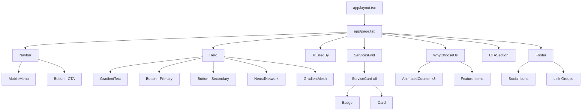
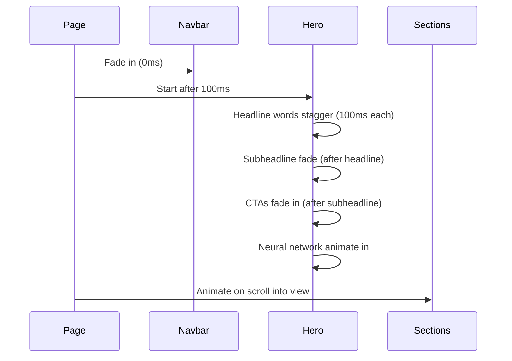
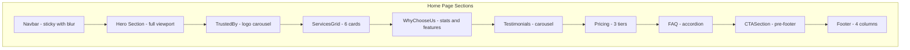

# Blackbeard Media Group - Website Architecture

## Project Overview

A modern, high-converting multi-page website for an AI-powered service agency built with Next.js 14, Tailwind CSS, Framer Motion, and TypeScript.

### Final Design Decisions

| Decision | Choice | Rationale |
|----------|--------|-----------|
| Logo | SVG Monogram - Stylized "B" with gradient | More aesthetic, professional tech agency branding |
| Neural Network | Canvas-based particle system | Dynamic, interactive, premium feel |
| Trusted By Logos | Geometric placeholder logos | Cleaner, more modern appearance |
| Site Scope | Multi-page (Home, Services, About, Contact) | Full agency website experience |
| Contact | Dedicated contact page with form | Better UX, SEO benefits |
| Additional Sections | Testimonials, Pricing, FAQ | Complete conversion funnel |

---

## Tech Stack

| Technology | Version | Purpose |
|------------|---------|---------|
| Next.js | 14+ | React framework with App Router |
| React | 18+ | UI library |
| TypeScript | 5+ | Type safety |
| Tailwind CSS | 3.4+ | Utility-first styling |
| Framer Motion | 11+ | Animations |
| Lucide React | Latest | Icon library |

---

## Project Structure

```
blackbeardmediagroup/
├── app/
│   ├── layout.tsx              # Root layout with fonts and metadata
│   ├── page.tsx                # Main landing page
│   ├── globals.css             # Global styles and Tailwind imports
│   ├── services/
│   │   └── page.tsx            # Services detail page
│   ├── about/
│   │   └── page.tsx            # About page
│   └── contact/
│       └── page.tsx            # Contact page with form
├── components/
│   ├── ui/                     # Reusable UI primitives
│   │   ├── Button.tsx
│   │   ├── Card.tsx
│   │   ├── Badge.tsx
│   │   ├── Container.tsx
│   │   ├── GradientText.tsx
│   │   ├── Input.tsx
│   │   ├── TextArea.tsx
│   │   └── Accordion.tsx
│   ├── layout/                 # Layout components
│   │   ├── Navbar.tsx
│   │   ├── MobileMenu.tsx
│   │   ├── Footer.tsx
│   │   └── Logo.tsx            # SVG monogram component
│   ├── sections/               # Page sections
│   │   ├── Hero.tsx
│   │   ├── TrustedBy.tsx
│   │   ├── ServicesGrid.tsx
│   │   ├── ServiceCard.tsx
│   │   ├── WhyChooseUs.tsx
│   │   ├── Testimonials.tsx    # New: Client testimonials carousel
│   │   ├── Pricing.tsx         # New: Tiered pricing cards
│   │   ├── FAQ.tsx             # New: Expandable FAQ accordion
│   │   └── CTASection.tsx
│   └── effects/                # Visual effects components
│       ├── ParticleNetwork.tsx # Canvas-based particle system
│       ├── GradientMesh.tsx
│       └── AnimatedCounter.tsx
├── lib/
│   ├── constants.ts            # Static data and configuration
│   ├── types.ts                # TypeScript interfaces
│   └── utils.ts                # Utility functions
├── hooks/
│   ├── useScrollPosition.ts
│   ├── useInView.ts
│   └── useParticleNetwork.ts   # Canvas animation hook
├── public/
│   └── images/                 # Static assets
├── tailwind.config.ts          # Extended Tailwind configuration
├── next.config.js              # Next.js configuration
├── tsconfig.json               # TypeScript configuration
└── package.json                # Dependencies
```

---

## Design System Implementation

### Color Palette (Tailwind Extended)

```typescript
colors: {
  // Primary backgrounds
  'deep-slate': '#0f172a',
  'near-black': '#020617',
  'slate-card': '#1e293b',
  
  // Accent colors
  'cyber-purple': '#8b5cf6',
  'ai-blue': '#3b82f6',
  'matrix-green': '#10b981',
  
  // Text colors
  'text-primary': '#f8fafc',
  'text-secondary': '#94a3b8',
  
  // Glassmorphism
  'glass': 'rgba(30, 41, 59, 0.5)',
  'glass-border': 'rgba(148, 163, 184, 0.1)',
}
```

### Typography Scale

| Element | Size | Weight | Tracking |
|---------|------|--------|----------|
| H1 | 4rem (64px) | 800 | -0.02em |
| H2 | 2.5rem (40px) | 700 | -0.01em |
| H3 | 1.5rem (24px) | 600 | normal |
| Body | 1rem (16px) | 400 | normal |
| Small | 0.875rem (14px) | 500 | normal |

### Animation Keyframes

```typescript
keyframes: {
  'fade-up': {
    '0%': { opacity: '0', transform: 'translateY(20px)' },
    '100%': { opacity: '1', transform: 'translateY(0)' },
  },
  'float': {
    '0%, 100%': { transform: 'translateY(0)' },
    '50%': { transform: 'translateY(-10px)' },
  },
  'glow-pulse': {
    '0%, 100%': { boxShadow: '0 0 20px rgba(139, 92, 246, 0.3)' },
    '50%': { boxShadow: '0 0 40px rgba(139, 92, 246, 0.6)' },
  },
  'scroll-left': {
    '0%': { transform: 'translateX(0)' },
    '100%': { transform: 'translateX(-50%)' },
  },
}
```

---

## Component Architecture

### Component Hierarchy Diagram



### Logo Component (SVG Monogram)

```typescript
// components/layout/Logo.tsx
interface LogoProps {
  size?: 'sm' | 'md' | 'lg';
  showText?: boolean;
}

// Features:
// - Stylized "B" with pirate-tech aesthetic
// - Gradient fill (purple-to-blue)
// - Subtle glow effect on hover
// - Optional "Blackbeard Media Group" text
```

**Logo Design Concept:**
```
   ╔══════╗
   ║  ▄▄  ║   Stylized "B" with:
   ║ █▀▀█ ║   - Angular, tech-inspired edges
   ║ █▄▄█ ║   - Gradient fill (cyber-purple to ai-blue)
   ║ █  █ ║   - Subtle circuit-line details
   ╚══════╝   - Glow effect on hover
```

### Component Specifications

#### 1. Navbar Component

```typescript
interface NavbarProps {
  logo: string;
  links: NavLink[];
  ctaText: string;
  ctaHref: string;
}

// Features:
// - Transparent on top, solid blurred background on scroll
// - useScrollPosition hook for scroll detection
// - Mobile hamburger menu with AnimatePresence
// - Hover underline animation on links
```

#### 2. Hero Section

```typescript
interface HeroProps {
  headline: string;
  subheadline: string;
  primaryCta: CTA;
  secondaryCta: CTA;
}

// Features:
// - Full viewport height (min-h-screen)
// - Staggered word animation for headline
// - Canvas-based particle network visualization
// - Interactive mouse tracking for particles
// - Gradient mesh background
// - Animated scroll indicator
```

#### 3. ParticleNetwork Component (Canvas-based)

```typescript
interface ParticleNetworkProps {
  particleCount?: number;      // Default: 80
  connectionDistance?: number; // Default: 150
  particleColor?: string;      // Default: cyber-purple
  lineColor?: string;          // Default: ai-blue at 30% opacity
  speed?: number;              // Default: 0.5
  interactive?: boolean;       // Mouse interaction
}

// Features:
// - WebGL/Canvas 2D rendering for performance
// - Floating particles with connecting lines
// - Mouse proximity effect (particles gravitate)
// - Responsive particle density
// - RequestAnimationFrame for smooth 60fps
// - Cleanup on unmount
```

#### 4. Testimonials Section

```typescript
interface Testimonial {
  id: string;
  quote: string;
  author: string;
  role: string;
  company: string;
  avatar?: string;
  rating: number;
}

interface TestimonialsProps {
  testimonials: Testimonial[];
  autoPlay?: boolean;
  interval?: number;
}

// Features:
// - Carousel with Framer Motion animations
// - Auto-play with pause on hover
// - Navigation dots
// - Star rating display
// - Glassmorphism quote cards
```

#### 5. Pricing Section

```typescript
interface PricingTier {
  id: string;
  name: string;
  price: string;
  period: string;
  description: string;
  features: string[];
  highlighted?: boolean;
  ctaText: string;
  ctaHref: string;
}

interface PricingProps {
  tiers: PricingTier[];
  showToggle?: boolean; // Monthly/Annual toggle
}

// Features:
// - 3-tier pricing layout (Starter, Professional, Enterprise)
// - Highlighted "Most Popular" tier
// - Feature comparison checkmarks
// - Gradient border on highlighted card
// - CTA buttons per tier
```

#### 6. FAQ Section

```typescript
interface FAQItem {
  id: string;
  question: string;
  answer: string;
}

interface FAQProps {
  items: FAQItem[];
  columns?: 1 | 2;
}

// Features:
// - Expandable accordion with AnimatePresence
// - Smooth height animation
// - Plus/minus icon rotation
// - Optional 2-column layout for desktop
// - Schema.org FAQ markup for SEO
```

#### 3. ServiceCard Component

```typescript
interface ServiceCardProps {
  title: string;
  description: string;
  icon: LucideIcon;
  badge: {
    text: string;
    variant: 'purple' | 'blue' | 'green';
  };
}

// Features:
// - Glassmorphism background
// - Gradient border on hover
// - Icon with colored glow effect
// - translateY(-8px) hover animation
```

#### 4. AnimatedCounter Component

```typescript
interface AnimatedCounterProps {
  end: number;
  suffix?: string;
  prefix?: string;
  duration?: number;
  label: string;
}

// Features:
// - Counts up when in viewport
// - Uses useInView hook
// - Configurable duration and format
```

---

## Data Constants Structure

```typescript
// lib/constants.ts

export const NAV_LINKS: NavLink[] = [
  { label: 'Services', href: '/services' },
  { label: 'About', href: '/about' },
  { label: 'Pricing', href: '/#pricing' },
  { label: 'Contact', href: '/contact' },
];

export const SERVICES: Service[] = [
  {
    id: 'writing',
    title: 'Writing Services',
    icon: 'PenLine',
    badge: { text: 'Powered by ChatGPT', variant: 'purple' },
    description: 'Blog posts, social media content, press releases, copywriting, and technical documentation crafted with precision.',
    features: ['Blog Posts & Articles', 'Social Media Content', 'Press Releases', 'Technical Documentation', 'Email Campaigns'],
  },
  {
    id: 'design',
    title: 'Design Services',
    icon: 'Palette',
    badge: { text: 'Powered by Midjourney', variant: 'blue' },
    description: 'Web design, UX/UI prototypes, brand identity systems, character design, and visual assets.',
    features: ['Web Design', 'UX/UI Prototypes', 'Brand Identity', 'Character Design', 'Visual Assets'],
  },
  {
    id: 'marketing',
    title: 'Marketing & SEO',
    icon: 'TrendingUp',
    badge: { text: 'Data-Driven', variant: 'green' },
    description: 'Strategic campaigns, email marketing automation, SEO optimization, and brand positioning.',
    features: ['SEO Optimization', 'PPC Campaigns', 'Email Automation', 'Analytics & Reporting', 'Brand Strategy'],
  },
  {
    id: 'assistant',
    title: 'Personal Assistant',
    icon: 'Calendar',
    badge: { text: '24/7 AI Support', variant: 'purple' },
    description: 'Intelligent scheduling, data entry automation, travel arrangements, and administrative tasks.',
    features: ['Scheduling', 'Data Entry', 'Travel Booking', 'Email Management', 'Research Tasks'],
  },
  {
    id: 'ecommerce',
    title: 'E-commerce Solutions',
    icon: 'ShoppingCart',
    badge: { text: 'Full-Stack', variant: 'blue' },
    description: 'Shopify development, product listing optimization, conversion rate optimization, and inventory management.',
    features: ['Shopify Development', 'Product Optimization', 'CRO', 'Inventory Management', 'Payment Integration'],
  },
  {
    id: 'discord',
    title: 'Discord Automation',
    icon: 'Bot',
    badge: { text: 'Custom Bots', variant: 'green' },
    description: 'ChatGPT and Midjourney bot integration, server management, community automation tools.',
    features: ['Custom Bots', 'ChatGPT Integration', 'Midjourney Bots', 'Moderation Tools', 'Analytics'],
  },
];

export const STATS: Stat[] = [
  { value: 500, suffix: '+', label: 'Projects Completed' },
  { value: 98, suffix: '%', label: 'Client Satisfaction' },
  { value: 24, suffix: 'hr', label: 'Average Response' },
];

export const FEATURES: Feature[] = [
  {
    icon: 'Zap',
    title: 'Lightning-Fast Delivery',
    description: 'Projects completed 3x faster than traditional agencies',
  },
  {
    icon: 'Sparkles',
    title: 'AI-Enhanced Quality',
    description: 'Advanced models ensure consistent, high-quality output',
  },
  {
    icon: 'Settings',
    title: 'Custom Solutions',
    description: 'Every project tailored to your unique business needs',
  },
  {
    icon: 'DollarSign',
    title: 'Transparent Pricing',
    description: 'No hidden fees, clear deliverables, measurable results',
  },
];

export const TESTIMONIALS: Testimonial[] = [
  {
    id: '1',
    quote: 'Blackbeard Media Group transformed our content strategy. Their AI-powered writing services delivered blog posts that actually convert.',
    author: 'Sarah Chen',
    role: 'Marketing Director',
    company: 'TechFlow Inc.',
    rating: 5,
  },
  {
    id: '2',
    quote: 'The speed and quality of their design work is unmatched. They created our entire brand identity in a week.',
    author: 'Marcus Johnson',
    role: 'Founder & CEO',
    company: 'Nexus Startups',
    rating: 5,
  },
  {
    id: '3',
    quote: 'Our Discord community engagement increased 300% after implementing their custom automation bots.',
    author: 'Elena Rodriguez',
    role: 'Community Manager',
    company: 'GameVerse Studios',
    rating: 5,
  },
];

export const PRICING_TIERS: PricingTier[] = [
  {
    id: 'starter',
    name: 'Starter',
    price: '$499',
    period: '/month',
    description: 'Perfect for small businesses getting started with AI',
    features: [
      '5 blog posts per month',
      '10 social media graphics',
      'Basic SEO optimization',
      'Email support',
      '48-hour turnaround',
    ],
    ctaText: 'Get Started',
    ctaHref: '/contact?plan=starter',
  },
  {
    id: 'professional',
    name: 'Professional',
    price: '$1,499',
    period: '/month',
    description: 'For growing businesses ready to scale',
    features: [
      '15 blog posts per month',
      '30 social media graphics',
      'Advanced SEO & analytics',
      'Priority support',
      '24-hour turnaround',
      'Custom Discord bot',
      'Monthly strategy call',
    ],
    highlighted: true,
    ctaText: 'Start Free Trial',
    ctaHref: '/contact?plan=professional',
  },
  {
    id: 'enterprise',
    name: 'Enterprise',
    price: 'Custom',
    period: '',
    description: 'Tailored solutions for large organizations',
    features: [
      'Unlimited content creation',
      'Dedicated account manager',
      'Custom AI model training',
      'White-label options',
      'SLA guarantee',
      'API access',
      'On-demand support',
    ],
    ctaText: 'Contact Sales',
    ctaHref: '/contact?plan=enterprise',
  },
];

export const FAQ_ITEMS: FAQItem[] = [
  {
    id: '1',
    question: 'How does AI-powered content creation work?',
    answer: 'We use advanced AI models like ChatGPT and Midjourney as creative assistants. Our experienced team guides and refines all AI output to ensure it meets your brand standards and business objectives.',
  },
  {
    id: '2',
    question: 'What is the typical turnaround time?',
    answer: 'Most projects are completed within 24-48 hours. Complex projects like brand identity systems or custom bot development may take 1-2 weeks.',
  },
  {
    id: '3',
    question: 'Do you offer revisions?',
    answer: 'Yes! All plans include unlimited revisions until you are 100% satisfied with the deliverables.',
  },
  {
    id: '4',
    question: 'Can I cancel my subscription anytime?',
    answer: 'Absolutely. There are no long-term contracts. You can cancel, upgrade, or downgrade your plan at any time.',
  },
  {
    id: '5',
    question: 'Is the content original and plagiarism-free?',
    answer: 'Yes. All content passes through plagiarism detection and is reviewed by our team for originality and quality.',
  },
  {
    id: '6',
    question: 'Do you work with international clients?',
    answer: 'Yes! We serve clients worldwide. Our AI-powered workflow enables us to deliver consistent quality across time zones.',
  },
];

export const COMPANY_INFO = {
  name: 'Blackbeard Media Group',
  tagline: 'AI-powered solutions for modern businesses',
  email: 'support@blackbeard.media',
  phone: '+1 (555) 123-4567',
  copyright: '2025 Blackbeard Media Group',
  socialLinks: {
    twitter: 'https://twitter.com/blackbeardmedia',
    linkedin: 'https://linkedin.com/company/blackbeardmedia',
    discord: 'https://discord.gg/blackbeardmedia',
    github: 'https://github.com/blackbeardmedia',
  },
};

export const FOOTER_LINKS = {
  services: [
    { label: 'Writing Services', href: '/services#writing' },
    { label: 'Design Services', href: '/services#design' },
    { label: 'Marketing & SEO', href: '/services#marketing' },
    { label: 'Personal Assistant', href: '/services#assistant' },
    { label: 'E-commerce', href: '/services#ecommerce' },
    { label: 'Discord Automation', href: '/services#discord' },
  ],
  resources: [
    { label: 'Blog', href: '/blog' },
    { label: 'Case Studies', href: '/case-studies' },
    { label: 'FAQ', href: '/#faq' },
    { label: 'Privacy Policy', href: '/privacy' },
    { label: 'Terms of Service', href: '/terms' },
  ],
  contact: [
    { label: 'Contact Form', href: '/contact' },
    { label: 'support@blackbeard.media', href: 'mailto:support@blackbeard.media' },
    { label: 'Schedule a Call', href: '/contact#schedule' },
  ],
};
```

---

## Animation Strategy

### Page Load Sequence



### Scroll Animation Configuration

```typescript
// Framer Motion viewport settings
const scrollAnimation = {
  initial: { opacity: 0, y: 30 },
  whileInView: { opacity: 1, y: 0 },
  viewport: { once: true, amount: 0.3 },
  transition: { duration: 0.6, ease: 'easeOut' },
};
```

### Hover State Transitions

| Element | Property | Duration | Easing |
|---------|----------|----------|--------|
| Buttons | scale, shadow | 200ms | ease-out |
| Cards | translateY, border | 300ms | ease-out |
| Links | underline width | 200ms | ease-out |
| Icons | scale, glow | 200ms | ease-out |

---

## Responsive Breakpoints

| Breakpoint | Width | Layout Changes |
|------------|-------|----------------|
| Mobile | 0-639px | Single column, hamburger menu, simplified animations |
| Tablet | 640-1023px | Two columns, adjusted spacing |
| Desktop | 1024px+ | Full layout, all visual effects |

### Mobile-Specific Adjustments

- Navbar: Hamburger menu with slide-in drawer
- Hero: Stacked layout, reduced animation complexity
- Services: Single column cards
- Footer: Stacked columns

---

## Performance Considerations

1. **Animation Optimization**
   - Use `transform` and `opacity` only for 60fps
   - `will-change` applied sparingly
   - Reduced motion media query support

2. **Image Optimization**
   - Next.js Image component with proper sizing
   - Lazy loading for below-fold content
   - WebP format where possible

3. **Code Splitting**
   - Dynamic imports for heavy components
   - Intersection Observer for lazy loading sections

4. **CSS Containment**
   - `contain: layout` for isolated sections
   - GPU acceleration for animated elements

---

## Accessibility Requirements

- Semantic HTML structure
- ARIA labels for interactive elements
- Focus visible states for keyboard navigation
- Color contrast ratios meeting WCAG 2.1 AA
- Reduced motion support via `prefers-reduced-motion`
- Skip to main content link

---

## File Dependencies

### Package.json Dependencies

```json
{
  "dependencies": {
    "next": "^14.0.0",
    "react": "^18.2.0",
    "react-dom": "^18.2.0",
    "framer-motion": "^11.0.0",
    "lucide-react": "^0.300.0",
    "clsx": "^2.0.0",
    "tailwind-merge": "^2.0.0"
  },
  "devDependencies": {
    "typescript": "^5.0.0",
    "@types/react": "^18.2.0",
    "@types/node": "^20.0.0",
    "tailwindcss": "^3.4.0",
    "autoprefixer": "^10.0.0",
    "postcss": "^8.0.0"
  }
}
```

---

## Page Structure

### Home Page (/)



### Services Page (/services)

- Hero with services overview
- Detailed service sections with full descriptions
- Individual service feature lists
- Related case studies/examples
- CTA to contact

### About Page (/about)

- Company story and mission
- Team section with placeholder avatars
- Values and approach
- AI philosophy/methodology
- CTA to services or contact

### Contact Page (/contact)

- Contact form with fields: name, email, company, service interest, message
- Direct contact information
- FAQ quick links
- Office hours/response time indicator
- Optional: Calendar scheduling embed

---

## Implementation Order

### Phase 1: Foundation (Tasks 1-5)
- Initialize Next.js 14 project with App Router
- Configure Tailwind with extended design system
- Set up TypeScript types and interfaces
- Create all constants and data files
- Build utility functions (cn, etc.)

### Phase 2: UI Primitives (Task 6)
- Button component (variants: primary, secondary, outline, ghost)
- Card component (glassmorphism styling)
- Badge component (color variants)
- Container component (max-width wrapper)
- Input/TextArea components
- Accordion component
- GradientText component

### Phase 3: Layout Components (Tasks 7, 16)
- Logo SVG monogram component
- Navbar with mobile menu and scroll detection
- Footer with 4-column layout

### Phase 4: Visual Effects (Task 8)
- ParticleNetwork canvas component
- GradientMesh background
- AnimatedCounter component

### Phase 5: Home Page Sections (Tasks 8-15)
- Hero section with particle network
- TrustedBy section with infinite scroll
- ServicesGrid + ServiceCard components
- WhyChooseUs section with animated stats
- Testimonials carousel section
- Pricing section with 3 tiers
- FAQ accordion section
- CTASection pre-footer

### Phase 6: Additional Pages (Tasks 17-19)
- Services detail page
- About page with team section
- Contact page with form

### Phase 7: Animation & Polish (Tasks 20-23)
- Implement all Framer Motion animations
- Add scroll-triggered animations with whileInView
- Responsive design refinements for all breakpoints
- Performance optimization (lazy loading, code splitting)
- Accessibility audit (ARIA labels, focus states, contrast)

---

## Estimated Component Count

| Category | Count |
|----------|-------|
| UI Primitives | 8 |
| Layout Components | 4 |
| Section Components | 10 |
| Effect Components | 3 |
| Page Files | 4 |
| Hooks | 3 |
| **Total** | **32** |

---

## Ready for Implementation

All architectural decisions have been finalized:

- ✅ SVG Monogram logo with gradient (stylized "B")
- ✅ Canvas-based particle network (interactive, dynamic)
- ✅ Geometric placeholder logos (modern, clean)
- ✅ Multi-page routing (Home, Services, About, Contact)
- ✅ Dedicated contact page with form
- ✅ Additional sections: Testimonials, Pricing, FAQ

**Next Step:** Switch to Code mode to begin implementation starting with project initialization and Tailwind configuration.